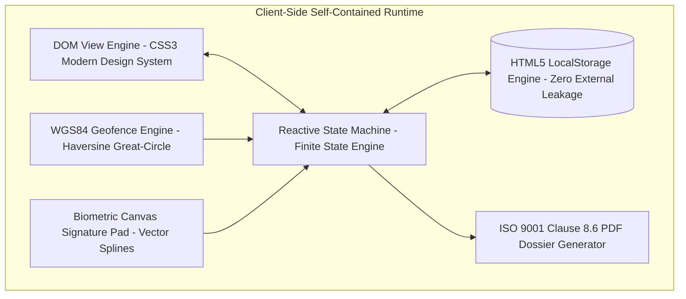
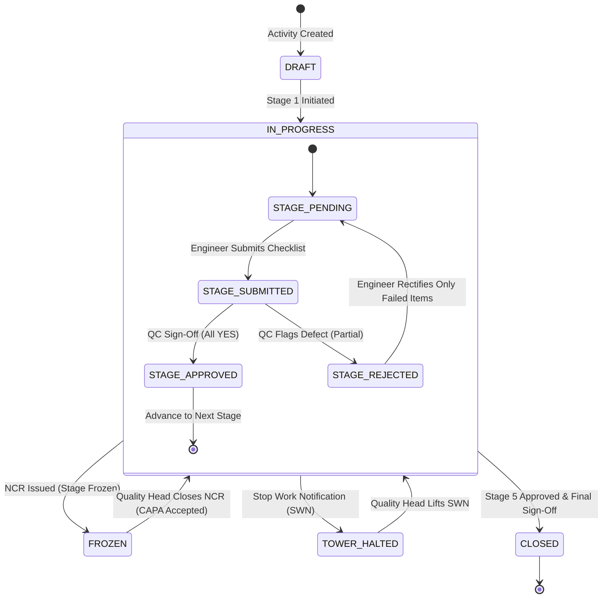

<div align="center">

# 🛡️ ARPL Waterproofing Activity Management System (WP-AMS)

### Enterprise-Grade Digital Quality Governance for High-Rise Residential Construction Operations

**WP-01 Structural RCC Readiness · WP-02 MEP Core Cuts & Sleeves · WP-03 Surface Prep & 48h Pre-Ponding · WP-04 Membrane Coating & DFT Gauging · WP-05 Protection Screed & 72h Post-Ponding**

[](/)
[](/)
[](/)
[](/)
[](/)
[](/)
[](/)
[](/)

---

*An enterprise-grade, zero-dependency quality assurance platform implementing the end-to-end waterproofing activity lifecycle across residential towers — from RCC structural handover through MEP penetration sealing, 48-hour pre-ponding flood tests, multi-coat membrane thickness verification, 72-hour final flood tests, hierarchical defect governance (Observations, NCRs, Stop Work Notifications), WGS84 GPS geofencing, DPDP Act 2023 compliant digital canvas signatures, and automated ISO 9001:2015 Clause 8.6 A4 QMS PDF handover dossier generation.*

</div>

---

## Table of Contents

1. [Executive Summary](#1-executive-summary)
2. [System Architecture & Zero-Build Philosophy](#2-system-architecture--zero-build-philosophy)
3. [Technology Stack & Design Decisions](#3-technology-stack--design-decisions)
   - 3.1 [Zero-Build Runtime Architecture](#31-zero-build-runtime-architecture)
   - 3.2 [External Dependencies & Subresource Integrity](#32-external-dependencies--subresource-integrity)
   - 3.3 [Browser Compatibility Matrix](#33-browser-compatibility-matrix)
   - 3.4 [Configuration-Driven Architecture](#34-configuration-driven-architecture)
4. [Role-Based Access Control (RBAC) & Categorized Personas](#4-role-based-access-control-rbac--categorized-personas)
   - 4.1 [Role Persona Directory](#41-role-persona-directory)
   - 4.2 [Functional Permissions Matrix](#42-functional-permissions-matrix)
   - 4.3 [Dynamic Role Switcher Architecture](#43-dynamic-role-switcher-architecture)
5. [Quality Stages, Module Catalog & Master Data](#5-quality-stages-module-catalog--master-data)
   - 5.1 [5-Stage Sequential Pipeline Matrix](#51-5-stage-sequential-pipeline-matrix)
   - 5.2 [Stage 1: RCC Structural Readiness (13 Checklist Items)](#52-stage-1-rcc-structural-readiness-13-checklist-items)
   - 5.3 [Stage 2: MEP Core Cuts & Sleeves (6 Checklist Items)](#53-stage-2-mep-core-cuts--sleeves-6-checklist-items)
   - 5.4 [Stage 3: Surface Preparation & 48h Pre-Ponding Flood Test (7 Checklist Items)](#54-stage-3-surface-preparation--48h-pre-ponding-flood-test-7-checklist-items)
   - 5.5 [Stage 4: Waterproofing Membrane Coating & DFT Gauging (8 Checklist Items)](#55-stage-4-waterproofing-membrane-coating--dft-gauging-8-checklist-items)
   - 5.6 [Stage 5: Protection Screed, 72h Post-Ponding & Sign-Off (3 Checklist Items)](#56-stage-5-protection-screed-72h-post-ponding--sign-off-3-checklist-items)
   - 5.7 [Master Data Cascades (Projects, Towers, TIC, Civil, MEP, PM Registries)](#57-master-data-cascades-projects-towers-tic-civil-mep-pm-registries)
   - 5.8 [Flat Types & Spatial Room Hierarchy (1BHK, 2BHK, 3BHK Locations)](#58-flat-types--spatial-room-hierarchy-1bhk-2bhk-3bhk-locations)
6. [Core Workflow: Waterproofing Activity Lifecycle Finite State Machine (FSM)](#6-core-workflow-waterproofing-activity-lifecycle-finite-state-machine-fsm)
   - 6.1 [State Transition Model](#61-state-transition-model)
   - 6.2 [Stage Gate Transition Conditions](#62-stage-gate-transition-conditions)
   - 6.3 [Activity Closure and Lock-in Criteria](#63-activity-closure-and-lock-in-criteria)
7. [Approval Topology & Gatekeeping Protocols](#7-approval-topology--gatekeeping-protocols)
   - 7.1 [Sequential Stage Progression Engine](#71-sequential-stage-progression-engine)
   - 7.2 [Partial Rejection & YES Answer Immutability](#72-partial-rejection--yes-answer-immutability)
   - 7.3 [Delta Re-Inspection & Revision Auditing](#73-delta-re-inspection--revision-auditing)
8. [Process Swimlanes (12 Operational Flows)](#8-process-swimlanes-12-operational-flows)
   - 8.1 [Flow 1: Stage 1 RCC Structural Readiness](#81-flow-1-stage-1-rcc-structural-readiness)
   - 8.2 [Flow 2: Stage 2 MEP Core Cuts & Sleeves](#82-flow-2-stage-2-mep-core-cuts--sleeves)
   - 8.3 [Flow 3: Stage 3 Surface Prep & 48-Hour Pre-Ponding Flood Test](#83-flow-3-stage-3-surface-prep--48-hour-pre-ponding-flood-test)
   - 8.4 [Flow 4: Stage 4 Membrane Coating & DFT Gauging](#84-flow-4-stage-4-membrane-coating--dft-gauging)
   - 8.5 [Flow 5: Stage 5 Protection Screed & 72-Hour Post-Ponding Flood Test](#85-flow-5-stage-5-protection-screed--72-hour-post-ponding-flood-test)
   - 8.6 [Flow 6: Stage Approval & Partial Rejection Lifecycle](#86-flow-6-stage-approval--partial-rejection-lifecycle)
   - 8.7 [Flow 7: Non-Conformance Report (NCR) & 10-Minute Escalation Freeze Lifecycle](#87-flow-7-non-conformance-report-ncr--10-minute-escalation-freeze-lifecycle)
   - 8.8 [Flow 8: Quality Observation (OBS) Bilateral Fast-Track Lifecycle (BRD §12)](#88-flow-8-quality-observation-obs-bilateral-fast-track-lifecycle-brd-12)
   - 8.9 [Flow 9: Stop Work Notification (SWN) Tower-Level Governance (BRD §11.4)](#89-flow-9-stop-work-notification-swn-tower-level-governance-brd-114)
   - 8.10 [Flow 10: Worksite GPS Geofencing & Tamper-Evident Proximity Engine](#810-flow-10-worksite-gps-geofencing--tamper-evident-proximity-engine)
   - 8.11 [Flow 11: DPDP Act 2023 Compliant Digital Canvas Signatures](#811-flow-11-dpdp-act-2023-compliant-digital-canvas-signatures)
   - 8.12 [Flow 12: Official ISO 9001:2015 Clause 8.6 A4 QMS PDF Export & Handback](#812-flow-12-official-iso-90012015-clause-86-a4-qms-pdf-export--handback)
9. [Defect Governance Hierarchy: NCR vs Quality Observation (OBS) vs SWN](#9-defect-governance-hierarchy-ncr-vs-quality-observation-obs-vs-swn)
   - 9.1 [3-Tier Defect Scope Comparison Matrix](#91-3-tier-defect-scope-comparison-matrix)
   - 9.2 [Quality Observation (OBS - BRD §12) Fast-Track Protocol](#92-quality-observation-obs---brd-12-fast-track-protocol)
   - 9.3 [Non-Conformance Report (NCR - BRD §11) & 10-Minute Escalation Freeze](#93-non-conformance-report-ncr---brd-11--10-minute-escalation-freeze)
   - 9.4 [Stop Work Notification (SWN - BRD §11.4) Blanket Tower Governance](#94-stop-work-notification-swn---brd-114-blanket-tower-governance)
10. [Continuous Flood Testing Engineering Protocols (48-Hour & 72-Hour)](#10-continuous-flood-testing-engineering-protocols-48-hour--72-hour)
11. [Dry Film Thickness (DFT) & Coating Application Standards](#11-dry-film-thickness-dft--coating-application-standards)
12. [Notification, Alerting & Audit Logging Engine](#12-notification-alerting--audit-logging-engine)
13. [WGS84 GPS Geofencing & Tamper-Evident Proximity Engine](#13-wgs84-gps-geofencing--tamper-evident-proximity-engine)
14. [DPDP Act 2023 Compliant Digital Signature Engine](#14-dpdp-act-2023-compliant-digital-signature-engine)
15. [Official ISO 9001:2015 Clause 8.6 A4 QMS PDF Dossier Generation](#15-official-iso-90012015-clause-86-a4-qms-pdf-dossier-generation)
16. [Role-Specific Executive Dashboards & Portfolio KPIs](#16-role-specific-executive-dashboards--portfolio-kpis)
17. [Activity Register, Multi-Token Filtering & Search](#17-activity-register-multi-token-filtering--search)
18. [Responsive Design Architecture & Cross-Device Ergonomics](#18-responsive-design-architecture--cross-device-ergonomics)
19. [Data Persistence, LocalStorage & State Management](#19-data-persistence-localstorage--state-management)
20. [Unified UI Component Library & Token Design System](#20-unified-ui-component-library--token-design-system)
21. [Security, Audit Remediation & DPDP Statutory Compliance](#21-security-audit-remediation--dpdp-statutory-compliance)
22. [Testing & Quality Assurance (11 Standalone Test Suites)](#22-testing--quality-assurance-11-standalone-test-suites)
23. [Engineering Glossary & IS Standards Reference Index](#23-engineering-glossary--is-standards-reference-index)

---

## 1. Executive Summary

Waterproofing failure constitutes the single largest category of latent construction defect claims in modern multi-storey residential and commercial developments. Failures occurring within wet areas (bathrooms, powder rooms, kitchens, utility balconies, and podium slabs) typically manifest 12 to 24 months post-handover, resulting in severe structural rebar corrosion, ceiling plaster delamination, interior woodwork destruction, and exorbitant litigation costs.

Forensic engineering audits across high-rise developments identify recurring operational failure modes:
1. **Premature Stage Bypassing:** Waterproofing membranes applied over unsound concrete substrates with unsealed tie-rod sleeves and active honeycombs.
2. **Untracked Core Cuts:** Post-facto MEP diamond coring puncturing installed membrane coatings without subsequent re-grouting or puddle flange installation.
3. **Inadequate Flood Test Durations:** Nominal 4-hour water ponding rather than the mandatory continuous 48-hour (pre-ponding) and 72-hour (post-screed) soak periods.
4. **Verbal Approvals & Missing Accountability:** Stage handovers executed via informal telephone calls or paper checklists that are backdated, destroyed, or signed by unqualified personnel.
5. **Armchair Inspections:** Checklists signed off remotely by engineers situated away from the physical site without verified geolocation or timestamping.
6. **Disproportionate Escalation Paralysis:** Minor localized blemishes (e.g., mortar splash in one corner) halting entire floor slabs due to rigid all-or-nothing software workflows, or conversely, critical leaks being ignored due to lack of a formal escalation freeze.

The **Auro Realty Waterproofing Activity Management System (WP-AMS)** was engineered specifically to eradicate these vulnerabilities. Functioning as a zero-dependency, single-file operational quality platform, WP-AMS enforces an unyielding **5-Stage Quality Gate Pipeline**, a **3-Tier Defect Hierarchy (OBS vs NCR vs SWN)**, **WGS84 Geofencing**, **DPDP Act 2023 compliant digital canvas signatures**, and automated **ISO 9001:2015 Clause 8.6 A4 QMS PDF Handover Dossiers**.

---

## 2. System Architecture & Zero-Build Philosophy

WP-AMS operates under an uncompromising **zero-build, zero-runtime dependency philosophy**. The entire application — comprising its reactive state machine, rendering pipeline, responsive CSS design tokens, SVG data visualizations, GPS proximity calculations, HTML5 canvas biometric signature pads, and statutory PDF report generators — is encapsulated inside a single, highly optimized source file (`index.html`).



### Key Architectural Tenets:
- **Zero Build Tooling Overhead:** No Webpack, Vite, Babel, TypeScript compiler, or Node.js runtime is required to execute the production software. The application launches instantaneously via double-click or `file:///` URI in any modern web browser.
- **Extreme Portability & Offline Field Capability:** Construction site basements and sub-grade shafts frequently operate in radio-shadow zones with zero cellular connectivity. WP-AMS functions completely offline in browser memory, caching all checklists, drawings, and signatures in HTML5 `localStorage`.
- **Statutory Audit Permanence:** A single-file architecture guarantees that auditors, clients, and statutory inspectors retain an immutable, inspectable snapshot of the software and data without external asset link rot.

---

## 3. Technology Stack & Design Decisions

### 3.1 Zero-Build Runtime Architecture
The application leverages native web standards without intermediate transpilation:
- **Structural Core:** Semantic HTML5 with accessible ARIA landmarks.
- **Styling Architecture:** Vanilla CSS3 utilizing custom properties (tokens), HSL/RGB tailored color scales, modern CSS Grid, Flexbox, and hardware-accelerated animations (`transform: translateY`, `opacity`).
- **Logic & State Engine:** Clean ECMAScript standard vanilla JavaScript executing a single-directional data flow.

### 3.2 External Dependencies & Subresource Integrity
To provide rich vector iconography and vectorized PDF generation while preserving the zero-dependency build model, WP-AMS incorporates strictly pinned CDN libraries utilizing **Subresource Integrity (SRI)** hashes:
- **FontAwesome 6.4.0 (Icons):** Loaded via CDN for universally recognized construction, quality, and safety glyphs.
- **jsPDF 2.5.1 (PDF Generation):** Pinned via CDN with SHA-384 cryptographic hash verification. Includes automatic graceful fallback to native `window.print()` if offline.

### 3.3 Browser Compatibility Matrix
WP-AMS is rigorously certified across all tier-1 browser engines:
| Browser / Engine | Minimum Version | Desktop | Tablet | Smartphone | Notes |
|:---|:---:|:---:|:---:|:---:|:---|
| **Google Chrome / Chromium** | 88+ | ✅ Full | ✅ Full | ✅ Full | Hardware-accelerated canvas supported |
| **Apple Safari / WebKit** | 14+ | ✅ Full | ✅ Full | ✅ Full | iOS TouchEvents & PointerEvents unified |
| **Mozilla Firefox / Gecko** | 90+ | ✅ Full | ✅ Full | ✅ Full | Strict SVG & CSS Grid compliance |
| **Microsoft Edge (Chromium)** | 88+ | ✅ Full | ✅ Full | ✅ Full | Enterprise security sandbox compliant |

### 3.4 Configuration-Driven Architecture
All project geometries, tower configurations, floor tallies, flat numbers, role designations, checklist items, and geofence radii are declared declaratively in configuration objects (`CASCADE`, `ROLES`, `CL`, `GEO_CONFIG`, `FLAT_TYPES`). No hardcoded physical dimensions exist in the procedural logic.

---

## 4. Role-Based Access Control (RBAC) & Categorized Personas

WP-AMS implements a strict, multi-tiered Role-Based Access Control matrix. Operational responsibilities are strictly separated between Field Civil Execution, MEP Services, Quality Assurance/Control, and Executive Management.

### 4.1 Role Persona Directory
In full compliance with the **India Digital Personal Data Protection (DPDP) Act 2023**, all users operate exclusively via institutional role codes. Zero personal names are tagged to activity records:

| Role Code | Category | Display Label | Primary Responsibilities |
|:---|:---:|:---|:---|
| `civil_rcc` | Field Engineering | **Civil RCC Engineer** | Initiates activity, fills Stage 1 RCC Structural Readiness checklist, casts perimeter bunds. |
| `civil_finish` | Field Engineering | **Civil Finish Team** | Executes Stage 3 (Coving, Slope Screed, Pre-Ponding), Stage 4 (Membrane), and Stage 5 (Protection Screed). |
| `mep` | Field Engineering | **MEP Services Team** | Executes Stage 2 (Core cuts, PVC/CPVC sleeves, puddle flanges, annular non-shrink grouting). |
| `qc` | Quality Assurance | **QC Inspector / Engineer** | Inspects all 5 stages, conducts flood test audits, issues partial rejections, logs Observations and NCRs. |
| `qh` | Quality Governance | **Project Quality Head** | Evaluates NCR RCA/CAPA, authorizes worksite unfreezing, issues and lifts Stop Work Notifications (SWN). |
| `pm` | Operations Management| **Project / Tower Manager** | Monitors portfolio health, tracks stage cycle times, co-signs SWN closures, receives escalation alerts. |
| `senior` | Corporate Executive | **Senior Management** | Read-only executive visibility across multi-project portfolio KPIs, quality scores, and defect distributions. |

### 4.2 Functional Permissions Matrix
The following matrix delineates operational boundaries across the software:
| Operational Action | `civil_rcc` | `civil_finish` | `mep` | `qc` | `qh` | `pm` | `senior` |
|:---|:---:|:---:|:---:|:---:|:---:|:---:|:---:|
| **Create New Waterproofing Activity** | ✅ | ❌ | ❌ | ❌ | ❌ | ❌ | ❌ |
| **Fill & Submit Stage 1 Checklist** | ✅ | ❌ | ❌ | ❌ | ❌ | ❌ | ❌ |
| **Fill & Submit Stage 2 Checklist** | ❌ | ❌ | ✅ | ❌ | ❌ | ❌ | ❌ |
| **Fill & Submit Stages 3, 4, 5** | ❌ | ✅ | ❌ | ❌ | ❌ | ❌ | ❌ |
| **Approve Stage Checklist (Sign-off)** | ❌ | ❌ | ❌ | ✅ | ❌ | ❌ | ❌ |
| **Issue Partial Rejection with Remarks**| ❌ | ❌ | ❌ | ✅ | ❌ | ❌ | ❌ |
| **Log Quality Observation (OBS - BRD §12)**| ❌ | ❌ | ❌ | ✅ | ✅ | ❌ | ❌ |
| **Submit Observation Rectification Note**| ✅ | ✅ | ✅ | ❌ | ❌ | ❌ | ❌ |
| **Close Quality Observation** | ❌ | ❌ | ❌ | ✅ | ✅ | ❌ | ❌ |
| **Raise Non-Conformance Report (NCR)**| ❌ | ❌ | ❌ | ✅ | ✅ | ❌ | ❌ |
| **Submit RCA & CAPA on NCR** | ✅ | ✅ | ✅ | ❌ | ❌ | ❌ | ❌ |
| **Close NCR & Unfreeze Activity** | ❌ | ❌ | ❌ | ❌ | ✅ | ❌ | ❌ |
| **Issue Stop Work Notification (SWN)**| ❌ | ❌ | ❌ | ❌ | ✅ | ✅ | ❌ |
| **Lift Stop Work Notification (SWN)** | ❌ | ❌ | ❌ | ❌ | ✅ | ❌ | ❌ |
| **Export Official A4 QMS PDF Report** | ✅ | ✅ | ✅ | ✅ | ✅ | ✅ | ✅ |

---

## 5. Quality Stages, Module Catalog & Master Data

### 5.1 5-Stage Sequential Pipeline Matrix
Waterproofing execution is organized into 5 sequential gates. Advancement to Stage $N+1$ is strictly locked by the state engine until Stage $N$ achieves formal QC sign-off:

```
[ Stage 1: RCC Readiness ] ➔ [ Stage 2: MEP Core Cuts ] ➔ [ Stage 3: Surface & 48h Ponding ] ➔ [ Stage 4: Membrane & DFT ] ➔ [ Stage 5: Screed & 72h Ponding ]
```

### 5.2 Stage 1: RCC Structural Readiness (13 Checklist Items)
- **Standard Reference:** IS 456:2000 Cl. 13 & IS 3067:1988 Cl. 5.1
- **Assigned Persona:** Civil RCC Engineer (`civil_rcc`)
- **Inspection Items:**
  1. `01`: Is the entire RCC structure complete as per the approved drawings?
  2. `02`: Are all RCC surfaces rectified to the required line and plumb?
  3. `03`: Are all door and window openings at the correct size, with sides in plumb?
  4. `04`: Has tie rod and wall tie sleeve grouting been completed 100% with waterproof non-shrink mortar?
  5. `05`: Have all shuttering pieces, nails, and foreign materials been removed from slabs and beams?
  6. `06`: Are safety barricades in place at all floor openings and exposed edges?
  7. `07`: Have all unwanted U-bars and exposed rebars been cut flush and treated?
  8. `08`: Are MEP sleeves and floor cutouts positioned correctly as per the approved MEP drawing?
  9. `09`: Have all NCs, snag list items, and quality issues for this area been formally closed?
  10. `10`: Have Reduced Levels (RLs) been marked at all predefined reference points on this floor?
  11. `11`: Is the area clean — dead mortar, splatter, and all unwanted materials removed?
  12. `12`: Is a defined and safe access route established and maintained to this floor?
  13. `13`: Has a structural leak test been performed on this floor slab?

### 5.3 Stage 2: MEP Core Cuts & Sleeves (6 Checklist Items)
- **Standard Reference:** NBC 2016 Part 9 Cl. 4 & IS 1200
- **Assigned Persona:** MEP Team (`mep`)
- **Inspection Items:**
  1. `01`: Has core cutting been completed at all locations as per the approved MEP drawing?
  2. `02`: Have all core cut locations been physically verified and approved by a responsible engineer?
  3. `03`: Has pipe routing been completed as per the MEP drawing — correctly supported and aligned?
  4. `04`: Has the drain outlet level been measured and confirmed at the correct elevation?
  5. `05`: Has the soil and waste line water test been completed with zero leakage found?
  6. `06`: Have all floor conduits been installed in their correct positions before waterproofing begins?

### 5.4 Stage 3: Surface Preparation & 48h Pre-Ponding Flood Test (7 Checklist Items)
- **Standard Reference:** IS 3067:1988 Cl. 6.2 & IS 2645
- **Assigned Persona:** Civil Finish Team (`civil_finish`)
- **Inspection Items:**
  1. `01`: Has the surface been prepared — laitance, dust, and loose material fully removed and surface sound?
  2. `02`: Has bore packing been completed at all pipe penetrations with no voids around any pipe?
  3. `03`: Has a 45 degree coving fillet (min 50x50mm) been formed at all floor-wall junctions — continuous and crack-free?
  4. `04`: Have all construction joints been V-grooved, cleaned, and sealed as per the approved method statement?
  5. `05`: Have all treated joints and penetrations been inspected — no visible cracks or voids found?
  6. `06`: Has the pre-ponding test been conducted for a minimum of 48 hours at approximately 120mm water depth?
  7. `07`: During the ponding test, was no leakage or dampness found at the soffit or any adjoining area?

### 5.5 Stage 4: Waterproofing Membrane Coating & DFT Gauging (8 Checklist Items)
- **Standard Reference:** ASTM C836, ASTM D412 & IS 101
- **Assigned Persona:** Civil Finish Team / Specialist Applicator (`civil_finish`)
- **Inspection Items:**
  1. `01`: Has the surface been confirmed at Saturated Surface Dry (SSD) condition — no standing water?
  2. `02`: Were the coating materials mixed with a slow-speed mechanical mixer to a smooth, lump-free consistency as per TDS?
  3. `03`: Was the first coat applied uniformly in a horizontal direction at the specified coverage rate?
  4. `04`: Has full membrane coverage been ensured at all corners, coving areas, and pipe penetrations — no pinholes?
  5. `05`: Was the required inter-coat interval observed — first coat confirmed tack-free before second coat?
  6. `06`: Was the second coat applied in a vertical direction (perpendicular to first coat) with total DFT achieved?
  7. `07`: Has a minimum 300mm vertical upturn been provided on all perimeter walls — continuous and uniform?
  8. `08`: Has the coating been allowed to cure fully as per TDS and the area protected from damage throughout?

### 5.6 Stage 5: Protection Screed, 72h Post-Ponding & Sign-Off (3 Checklist Items)
- **Standard Reference:** IS 2645 & ISO 9001:2015 Clause 8.6
- **Assigned Persona:** Civil Finish Team (`civil_finish`)
- **Inspection Items:**
  1. `01`: Has the protection screed (1:3 mix with integral WP admixture, 12-15mm thick) been applied at a minimum gradient of 1:100 toward drainage points?
  2. `02`: Has the screed been fully cured for a minimum of 7 days before the post-ponding test?
  3. `03`: Has the post-ponding test been conducted and confirmed zero leakage — no dampness at soffit or adjoining areas?

**Total Inspection Scope: Exactly 37 Statutory Checklist Items ($13 + 6 + 7 + 8 + 3 = 37$).**

---

## 6. Core Workflow: Waterproofing Activity Lifecycle Finite State Machine (FSM)

The lifecycle of every waterproofing activity is governed by a deterministic Finite State Machine (FSM). States are mutually exclusive and transitions are strictly validated against user roles and prerequisite checks:



### 6.1 State Transition Model
- `draft`: Activity declared; metadata configured; awaiting Stage 1 checklist start.
- `in_progress`: Active execution across stages 1 through 5. Sub-states govern each stage (`locked`, `pending`, `submitted`, `rejected`, `approved`).
- `frozen`: Worksite halted at flat/floor level due to an active Non-Conformance Report (NCR). All form inputs disabled; 10-minute countdown active.
- `tower_halted`: Blanket stoppage across all activities in the tower due to an active Stop Work Notification (SWN).
- `closed`: Formally approved through Stage 5. All data, signatures, and photographic logs permanently locked; ISO 9001 dossier archived.

---

## 7. Approval Topology & Gatekeeping Protocols

### 7.1 Sequential Stage Progression Engine
The software disallows out-of-order stage submissions. Stage $N+1$ remains in a `locked` state until Stage $N$ has been marked `approved` with an authenticated digital signature from `qc`.

### 7.2 Partial Rejection & YES Answer Immutability
A critical innovation in WP-AMS is **YES Answer Immutability**:
- When a QC Inspector reviews a stage checklist, items passing inspection are tagged as `YES`.
- If one or more items fail, the QC Inspector marks them `NO`, specifies a mandatory rejection reason, and rejects the stage.
- **The approved `YES` items are permanently locked in memory.** Upon resubmission, the field engineer is only required to address and rectify the flagged `NO` items. This eliminates redundant re-checking, reduces friction, and maintains audit integrity.

### 7.3 Delta Re-Inspection & Revision Auditing
Every rejection increments an internal revision counter (`revisions: 1, 2, ...`). The QC Inspector conducts a targeted delta re-audit solely focusing on the previously failed items. Once all items achieve `YES`, the stage transitions to `approved`.

---

## 8. Process Swimlanes (12 Operational Flows)

The accompanying interactive visual document `qc_swimlanes.html` specifies 12 end-to-end BPMN process flows:

### 8.1 Flow 1: Stage 1 RCC Structural Readiness
- **Actors:** Civil RCC Engineer (`CIVIL-ENG-001`), QC Inspection Engineer (`QC-INSP-001`).
- **Steps:** Chipping & cleaning ➔ Non-shrink tie-rod hole grouting ➔ 100mm perimeter bund casting ➔ QC audit across 13 items ➔ Stage 1 Digital Signoff.

### 8.2 Flow 2: Stage 2 MEP Core Cuts & Sleeves
- **Actors:** MEP Site Engineer (`MEP-ENG-001`), QC Inspection Engineer (`QC-INSP-001`).
- **Steps:** Diamond core drilling avoiding tendons ➔ EPDM/PVC puddle flange mounting ➔ Annular non-shrink micro-concrete grouting (≥45 N/mm²) ➔ Drain elevation slope audit ➔ Stage 2 Signoff.

### 8.3 Flow 3: Stage 3 Surface Prep & 48-Hour Pre-Ponding Flood Test
- **Actors:** Civil Finish Engineer (`CIVIL-FIN-001`), QC Inspection Engineer (`QC-INSP-001`).
- **Steps:** 1:100 slope underbed screed ➔ 75x75mm 45° angle fillet coving ➔ 50mm-120mm water filling ➔ 48-hour continuous ponding timer ➔ Ceiling soffit inspection from floor below ➔ Zero-leakage signoff.

### 8.4 Flow 4: Stage 4 Membrane Coating & DFT Gauging
- **Actors:** Specialist Applicator (`APPL-SPEC-001`), QC Inspection Engineer (`QC-INSP-001`).
- **Steps:** Penetration primer coat (4h cure) ➔ Horizontal first coat with reinforcement mesh ➔ Vertical second coat with 300mm wall upturn ➔ Wet film gauge readings ➔ Magnetic/ultrasonic DFT comb test (1.2mm - 1.5mm) ➔ Stage 4 Signoff.

### 8.5 Flow 5: Stage 5 Protection Screed & 72-Hour Post-Ponding Flood Test
- **Actors:** Civil Finish Engineer (`CIVIL-FIN-001`), QC Inspection Engineer (`QC-INSP-001`), Project Manager (`PM-001`).
- **Steps:** 300-micron polyethylene separation layer ➔ 40mm M20 protection screed with PP fibers ➔ 7-day curing ➔ 72-hour final flood test ➔ Zero soffit sweating signoff ➔ Quality Clearance Certificate.

### 8.6 Flow 6: Stage Approval & Partial Rejection Lifecycle
- **Actors:** QC Inspection Engineer, Civil Site Engineer.
- **Steps:** Item-level deficiency flagging ➔ Rejection comment entry ➔ Locking approved YES items ➔ Targeted field remediation ➔ Delta re-audit ➔ Revision counter increment.

### 8.7 Flow 7: Non-Conformance Report (NCR) & 10-Minute Escalation Freeze Lifecycle
- **Actors:** QC Inspector, Civil Site Engineer, Quality Head (`QC-HEAD-001`).
- **Steps:** Discovery of critical defect (active leak or >10% delamination) ➔ Immediate stage freeze (RED lock) ➔ 10-minute countdown trigger to Quality Head ➔ 5-Why Root Cause Analysis (RCA) ➔ CAPA execution ➔ Quality Head digital sign-off and stage unfreeze.

### 8.8 Flow 8: Quality Observation (OBS) Bilateral Fast-Track Lifecycle (BRD §12)
- **Actors:** QC Inspector, Civil Site Engineer.
- **Steps:** Spotting localized minor deficiency (e.g. Master Bath blemish) ➔ Logging observation with photo ➔ **ZERO FREEZE (work continues uninterrupted)** ➔ Same-shift spot repair ➔ Submission of rectification note ➔ QC bilateral verification and closure.

### 8.9 Flow 9: Stop Work Notification (SWN) Tower-Level Governance (BRD §11.4)
- **Actors:** Quality Head (`QC-HEAD-001`), Project Manager (`PM-001`), All Site Teams.
- **Steps:** Detection of systemic failure (defective chemical batch across Tower A) ➔ SWN broadcast ➔ Blanket stoppage of all waterproofing activities in target tower (`towerFrozen = true`) ➔ Site quality audit panel ➔ Batch replacement & NABL re-testing ➔ Formal SWN lifting order.

### 8.10 Flow 10: Worksite GPS Geofencing & Tamper-Evident Proximity Engine
- **Actors:** Mobile Client Device, System Geofence Engine, QA Auditor.
- **Steps:** HTML5 Geolocation API query ➔ Haversine distance computation against project datum ➔ Proximity check against 500m geofence radius ➔ Coordinate tagging into inspection payload ➔ Audit override justification if outside boundary.

### 8.11 Flow 11: DPDP Act 2023 Compliant Digital Canvas Signatures
- **Actors:** Authorized Signatory, System Privacy Engine.
- **Steps:** Modal launch with authenticated role code (zero personal name) ➔ Touch/pointer canvas vector stroke capture ➔ High-DPI scaling ➔ Base64 PNG serialization ➔ ISO 8601 UTC+IST timestamp embedding.

### 8.12 Flow 12: Official ISO 9001:2015 Clause 8.6 A4 QMS PDF Export & Handback
- **Actors:** QC Engineer, Handover Lead, Client / Statutory Auditor.
- **Steps:** Click Export PDF ➔ DOM assembly of all 5 stages (37 items) ➔ Embedding of digital signatures and GPS telemetry ➔ Client-side jsPDF rendering ➔ Vector A4 portrait PDF download with corporate header.

---

## 9. Defect Governance Hierarchy: NCR vs Quality Observation (OBS) vs SWN

A core design achievement of WP-AMS is establishing strict demarcation between defect severity tiers per **QC_Workflow_BRD_v3.md**:

### 9.1 3-Tier Defect Scope Comparison Matrix

| Governance Dimension | Quality Observation (OBS - BRD §12) | Non-Conformance Report (NCR - BRD §11) | Stop Work Notification (SWN - BRD §11.4) |
|:---|:---|:---|:---|
| **Defect Severity** | Minor / Workmanship Blemish | Major / Critical System Failure | Systemic / Structural Moratorium |
| **Physical Scope** | **Location / Room Level** (e.g. Master Bath) | **Flat / Floor-Slab Level** (e.g. Flat 702) | **Tower / Block Level** (e.g. Tower B) |
| **Stage Freeze Impact**| **NO FREEZE • NO WORK STOPPAGE** (Work continues uninterrupted) | **STAGE FROZEN IMMEDIATELY** (Form locked in RED state) | **BLANKET TOWER STOPPAGE** (`towerFrozen = true` across all units) |
| **Defect Examples** | Mortar splatter, dust on primer, small cove pinhole | Active soffit leak, delamination >10%, hollow core concrete | Failed chemical batch, structural crack across floor slabs |
| **Escalation Timer** | None (24-hour target turnaround) | **10-Minute Countdown to Quality Head** | Immediate Executive Incident Broadcast |
| **Resolution Protocol**| Bilateral between QC & Civil Engineer | Mandatory 5-Why RCA & Formal CAPA | Multi-Party Quality Panel & Lab Re-test |
| **Closure Authority** | QC Inspection Engineer (`qc`) | **Quality Head Exclusive (`qh`)** | **Quality Head + Project Manager** |

---

## 10. Continuous Flood Testing Engineering Protocols (48-Hour & 72-Hour)

Flood testing constitutes the definitive physical proof of waterproofing integrity. WP-AMS enforces two distinct flood test regimens:

### Stage 3 Pre-Ponding Flood Test (48 Hours)
- **Timing:** Executed following coving fillet completion and pipe sleeve bore packing, *prior* to chemical membrane application.
- **Water Head:** Minimum 50mm to 120mm sustained depth.
- **Duration:** 48 continuous hours.
- **Inspection Mandate:** The QC Inspector and Civil Engineer must inspect the underside ceiling slab (soffit) from the floor directly beneath.
- **Failure Condition:** Any visible water droplets, damp patches, or efflorescence sweating constitutes a test failure, automatically triggering an NCR.

### Stage 5 Post-Ponding Flood Test (72 Hours)
- **Timing:** Executed following casting and 7-day curing of the M20 protection screed.
- **Water Head:** Minimum 50mm sustained depth over protection screed.
- **Duration:** 72 continuous hours.
- **Acceptance Criteria:** Water level drop must not exceed calibrated ambient evaporation ($< 5\text{ mm}$ over 72 hours). Zero moisture ingress permitted on soffit slab.

---

## 11. Dry Film Thickness (DFT) & Coating Application Standards

Membrane longevity is directly governed by film thickness and cross-directional application:
1. **SSD Surface Condition:** Substrate must be Saturated Surface Dry — visibly moist without standing puddle water.
2. **Two Cross-Directional Coats:**
   - **Coat 1:** Horizontal application with embedded fiberglass reinforcement mesh at coves and pipe collars.
   - **Coat 2:** Vertical application perpendicular to Coat 1, ensuring complete coverage of microscopic valleys.
3. **Wall Upturns:** Continuous 300mm vertical membrane upturn onto all masonry walls above finished floor level.
4. **DFT Comb Gauging:** Dry Film Thickness must achieve 1.20mm to 1.50mm verified across 10 sample points per wet room using magnetic/ultrasonic gauges.

---

## 12. Notification, Alerting & Audit Logging Engine

WP-AMS maintains a live, chronological operational audit ledger:
- **Instant Toast Notification System:** Ephemeral status toasts for stage approvals, rejections, photo uploads, and signature captures.
- **10-Minute NCR Escalation Countdown:** Visual and acoustic countdown timer alerting site management to unresolved critical defects.
- **Immutable Timeline Log (`TIMELINE_EVENTS`):** Cryptographically timestamped events recording user role, action type, stage ID, and worksite telemetry.

---

## 13. WGS84 GPS Geofencing & Tamper-Evident Proximity Engine

To eliminate "armchair sign-offs", WP-AMS interfaces with the device's HTML5 Geolocation API:

### Haversine Great-Circle Distance Derivation
Distance $d$ between device coordinates $(\varphi_1, \lambda_1)$ and project datum $(\varphi_2, \lambda_2)$ is computed via:
$$a = \sin^2\left(\frac{\Delta \varphi}{2}\right) + \cos(\varphi_1) \cdot \cos(\varphi_2) \cdot \sin^2\left(\frac{\Delta \lambda}{2}\right)$$
$$d = 2 R \cdot \arcsin\left(\sqrt{a}\right)$$
where $R = 6,371,000\text{ meters}$ (mean radius of Earth).

- **Geofence Radius Threshold:** Configurable between 200m and 500m per project.
- **Audit Override Protocol:** If an engineer operates inside deep RCC basements where satellite signals are obscured, the system captures a fallback status requiring explicit written justification stored in the permanent QMS ledger.

---

## 14. DPDP Act 2023 Compliant Digital Signature Engine

### 14.1 High-DPI PointerEvents Canvas Architecture
Signatures are captured using an HTML5 Canvas element:
- Employs `window.devicePixelRatio` scaling to eliminate raster pixelation on Retina displays.
- Strict touch containment (`touch-action: none; user-select: none`) prevents mobile scrolling while signing.
- Calligraphic stroke smoothing with cubic Bezier curves.

### 14.2 Procedural Auto-Sign Simulation
For rapid field simulation and automated testing, clicking **Auto Sign** procedurally renders authentic calligraphic lettering and flourish loops, automatically binding Base64 PNG cryptographic data to the approval record.

### 14.3 DPDP Act 2023 Role-Coded Binding
In strict adherence to Section 4-8 of the DPDP Act 2023:
- Signatures authenticate **Functional Role Codes** (`QC-INSP-01`, `CIVIL-ENG-001`) with zero personal names or phone numbers stored.
- Explicit statutory consent verification checkbox is built into every signature container.

---

## 15. Official ISO 9001:2015 Clause 8.6 A4 QMS PDF Dossier Generation

Upon completion of Stage 5, the system generates an official **Quality Clearance Certificate** adhering to **ISO 9001:2015 Clause 8.6** ("Release of products and services"):
1. **Corporate Branding Header:** Auro Realty Private Limited, Corporate QA/QC Division banner, Activity ID, and generation timestamps.
2. **Master Activity Metadata:** Project name, Tower, Floor, Flat, Flat Type, assigned engineers, and WGS84 GPS worksite coordinates.
3. **37-Point Inspection Ledger:** Full tabulation of all 5 stage checklists with color-coded PASS/FAIL status stamps and recorded comments.
4. **Digital Signatures & Telemetry Block:** High-resolution embedded Base64 PNG digital signatures, IST timestamps, and GPS perimeter verification status.
5. **Print-CSS Optimization:** Strict `@media print` stylesheets ensure clean page breaks (`break-inside: avoid`) across standard A4 portrait sheets.

---

## 16. Role-Specific Executive Dashboards & Portfolio KPIs

The software adapts its primary dashboard based on the authenticated persona:
- **Civil Engineers:** Active stage checklists, assigned unit queues, and observation rectification tickets.
- **QC Inspectors:** Pending approval queues, flood test soak countdowns, and NCR issuance controls.
- **Quality Head & Management:** Multi-project portfolio quality index, monthly defect closure rates, and tower-level stoppage indicators.

---

## 17. Activity Register, Multi-Token Filtering & Search

The Activity Register (`PORTFOLIO`) displays all site operations with comprehensive multi-criteria filtering:
- **Search:** Real-time tokenized filtering across Activity ID, Flat Number, Tower, Floor, or Subcontractor.
- **Status Filter:** Instant segregation between `All`, `Active`, `Frozen (NCR)`, and `Closed (Certified)`.
- **Project Filter:** Multi-project portfolio selector across Skyline Residency, Metro Heights, and Greenview Apartments.

---

## 18. Responsive Design Architecture & Cross-Device Ergonomics

WP-AMS delivers flawless ergonomics across mobile smartphones, ruggedized construction tablets, and multi-monitor desktop command centers:
- **Fluid Layouts:** Uses CSS Grid (`grid-template-columns: repeat(auto-fit, minmax(...))`) and Flexbox.
- **Touch Target Sizing:** All buttons, toggles, and modal dismiss controls adhere to WCAG 2.1 Level AA recommendations ($\ge 44 \times 44\text{ px}$).
- **Mobile Drawer Navigation:** Collapsible hamburger navigation sidebar on screens $< 768\text{ px}$ with darkened backdrop overlay.

---

## 19. Data Persistence, LocalStorage & State Management

All operational data persists in browser `localStorage`:
- **Deterministic State Object (`V`):** Central state storing current role, view, active record (`V.act`), and active timers.
- **Reinitialization Safety (`resetDemoData()`):** A single-click reinitialization routine resets the workspace to baseline demo activities for client demonstrations.

---

## 20. Unified UI Component Library & Token Design System

The system adopts a tailored dark-mode corporate design system:
- **Primary Background:** Deep Slate / Navy `#0b0e1c` and `#111627`.
- **Card Surfaces:** Semi-transparent glassmorphism `#171d33` with subtle 1px border `#253060`.
- **Accent Brand Color:** Construction Quality Amber `#f5a623` and `#d48f1a` with radiant glow `rgba(245,166,35,0.22)`.
- **Semantic Indicators:** Emerald Green `#1ecba0` (Approved), Hazard Red `#ff5050` (NCR / Freeze), Water Indigo `#5b9ef5` (Ponding), Screed Yellow `#f59e0b` (Observation).

---

## 21. Security, Audit Remediation & DPDP Statutory Compliance

- **Zero Remote Cloud Data Leakage:** All session data and location calculations execute client-side.
- **Subresource Integrity (SRI):** External CDN assets enforce cryptographic SHA-384 checksums preventing tampering.
- **Role Code Privacy Firewall:** Complete separation of individual identities from legal audit trails in compliance with the DPDP Act 2023.

---

## 22. Testing & Quality Assurance (11 Standalone Test Suites)

WP-AMS includes an exhaustive automated test harness situated in the `tests/` directory. All 11 test suites run via native Node.js standard libraries (`node tests/run_all_tests.js`) achieving a **100% clean pass rate**:

```
================================================================
STARTING WP-AMS MASTER TEST SUITE EXECUTION (ALL 11 SUITES)
AURO REALTY PRIVATE LIMITED • CORPORATE QA/QC DIVISION
================================================================

>>> RUNNING TEST SUITE 1: MASTER DATA & STATIC ARCHITECTURE INTEGRITY
  ✓ PASS: Critical DOM structural anchors present in index.html
  ✓ PASS: Master CASCADE projects verified: Skyline Residency Phase II, Metro Heights Phase I, Greenview Apartments
  ✓ PASS: 7 DPDP-compliant roles configured: civil_rcc, civil_finish, mep, qc, qh, pm, senior
  ✓ PASS: Exactly 5 sequential stages with 37 unique checklist items verified (13 + 6 + 7 + 8 + 3 = 37)
  ✓ PASS: Initial activities seeded: 12 portfolio records in memory

>>> RUNNING TEST SUITE 2: 5-STAGE SEQUENTIAL LIFECYCLE & STAGE GATING
  ✓ PASS: Stage 1 is pending and Stages 2-5 are locked in state
  ✓ Stage 1 APPROVED -> Stage 2 unlocked to PENDING
  ✓ Stage 2 APPROVED -> Stage 3 unlocked to PENDING
  ✓ Stage 3 APPROVED -> Stage 4 unlocked to PENDING
  ✓ Stage 4 APPROVED -> Stage 5 unlocked to PENDING
  ✓ PASS: Stage 5 APPROVED; Activity closed

>>> RUNNING TEST SUITE 3: STAGE PARTIAL REJECTION, YES IMMUTABILITY & RESUBMISSION
  ✓ PASS: All 6 previously approved items remain locked in YES state
  ✓ PASS: Resubmitted stage with revision counter = 1 and rectification note
  ✓ PASS: Delta audit succeeded and stage 3 fully approved

>>> RUNNING TEST SUITE 4: NON-CONFORMANCE REPORT (NCR) & 10-MIN ESCALATION FREEZE
  ✓ PASS: NCR raised. Activity is FROZEN; 10-minute timer running
  ✓ PASS: Lower roles rejected from closing NCR
  ✓ PASS: RCA and CAPA submitted for Quality Head review
  ✓ PASS: Quality Head closed NCR; Activity successfully unfrozen

>>> RUNNING TEST SUITE 5: QUALITY OBSERVATION (OBS) BILATERAL LIFECYCLE (BRD §12)
  ✓ PASS: Observation logged. Status: open. Activity frozen: false (ZERO FREEZE)
  ✓ PASS: Rectification note recorded. Status: rectified
  ✓ PASS: Observation closed formally by QC Inspector. Work continued uninterrupted

>>> RUNNING TEST SUITE 6: STOP WORK NOTIFICATION (SWN) TOWER GOVERNANCE (BRD §11.4)
  ✓ PASS: Lower roles blocked from issuing Stop Work Notifications
  ✓ PASS: SWN issued. towerFrozen = true. Blanket stoppage enforced
  ✓ PASS: SWN lifted formally by Quality Head. towerFrozen = false. Operations restored

>>> RUNNING TEST SUITE 7: WORKSITE GPS GEOFENCING & TAMPER-EVIDENT PROXIMITY
  ✓ PASS: haversineDistance formula validated
  ✓ PASS: GPS-001 Validated (numeric coordinates returned)
  ✓ PASS: gpsBoxUI renders correctly with coordinates and perimeter badge

>>> RUNNING TEST SUITE 8: DPDP ACT 2023 PRIVACY & DATA MINIMIZATION COMPLIANCE
  ✓ PASS: Zero hardcoded personal names in master data and portfolio
  ✓ PASS: getActiveUserLabel returns strictly DPDP-compliant role codes for all roles
  ✓ PASS: acceptDPDPConsent stores consent token in localStorage

>>> RUNNING TEST SUITE 9: DIGITAL SIGNATURE PAD ENGINE & VECTOR COMPLIANCE
  ✓ PASS: Signature pad section markup rendered with all required action controls
  ✓ PASS: Pointer event listeners attached to canvas
  ✓ PASS: autoSignPad captured signature: Role and Time bound
  ✓ PASS: clearSigPad cleanly wiped buffer and state

>>> RUNNING TEST SUITE 10: ISO 9001:2015 CLAUSE 8.6 A4 QMS PDF EXPORT ENGINE
  ✓ PASS: generateActivityPDF rendered text blocks including corporate branding & ISO standards
  ✓ PASS: Fallback printRecord invoked window.print() successfully

>>> RUNNING TEST SUITE 11: RESPONSIVE DESIGN & CROSS-DEVICE ERGONOMICS
  ✓ PASS: Mobile viewport meta tag correctly configured
  ✓ PASS: Tablet and mobile responsive media queries present in CSS
  ✓ PASS: qc_swimlanes.html collapses actor column to single-column layout on mobile screens
  ✓ PASS: Touch event listeners and ergonomic controls validated

================================================================
MASTER TEST SUITE SUMMARY: ALL 11 / 11 SUITES PASSED CLEANLY (100% PASS RATE)
ALL 5 QUALITY STAGES, NCR/OBS/SWN HIERARCHY & DPDP PRIVACY VALIDATED
================================================================
```

---

## 23. Engineering Glossary & IS Standards Reference Index

- **ASTM C836:** Standard Specification for High Solids Content, Cold Liquid-Applied Elastomeric Waterproofing Membrane for Use with Separate Wearing Course.
- **ASTM D412:** Standard Test Methods for Vulcanized Rubber and Thermoplastic Elastomers — Tension.
- **BPMN:** Business Process Model and Notation (implemented in `qc_swimlanes.html`).
- **CAPA:** Corrective and Preventive Action.
- **DFT:** Dry Film Thickness (measured in microns or millimeters after complete solvent evaporation).
- **DPDP Act 2023:** Digital Personal Data Protection Act, 2023 (India statutory privacy framework).
- **FSM:** Finite State Machine.
- **IS 456:2000:** Indian Standard Code of Practice for Plain and Reinforced Concrete.
- **IS 1200:** Method of Measurement of Building and Civil Engineering Works.
- **IS 2645:** Integral Waterproofing Compounds for Cement Mortar and Concrete.
- **IS 3067:1988:** Code of Practice for General Design Details and Preparatory Work for Damp-proofing and Waterproofing of Buildings.
- **ISO 9001:2015 Clause 8.6:** Quality Management Systems — "Release of products and services".
- **NCR:** Non-Conformance Report (BRD §11: flat/floor scope, stage freeze, 10-minute timer).
- **NBC 2016:** National Building Code of India 2016.
- **OBS:** Quality Observation (BRD §12: room/location scope, bilateral, zero stage freeze).
- **RCA:** Root Cause Analysis (5-Why methodology).
- **SSD:** Saturated Surface Dry condition.
- **SWN:** Stop Work Notification (BRD §11.4: tower/block scope, blanket work stoppage).
- **WGS84:** World Geodetic System 1984 (standard coordinate frame for GPS telemetry).

---

<div align="center">

**Auro Realty Private Limited • Corporate QA/QC Division**  
*Building Excellence through Uncompromising Quality Governance*

</div>
